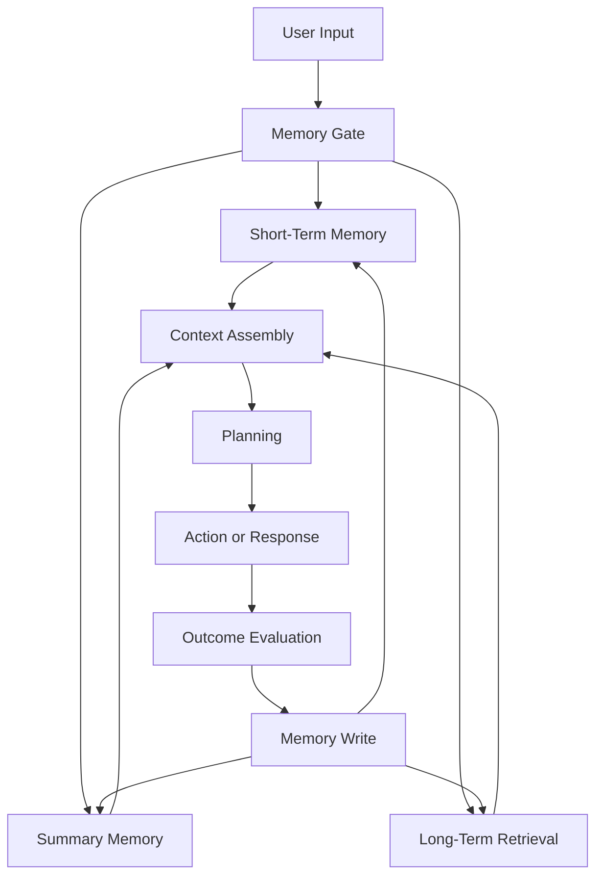

# Memory Agents — From Continuity to Cognition

This repository is a progressive implementation of memory systems for AI agents.

The goal is not to build one chatbot with memory. The goal is to understand memory as a cognitive system: how agents keep continuity, compress experience, retrieve what matters, plan from outcomes, form skills, preserve identity, and eventually remember the world they act inside.

Memory is treated here as an architectural primitive, not a feature toggle.

---

## Core thesis

Most AI systems are stateless, reactive, short-lived, and context-fragile.

Real agents need memory that can:

- preserve continuity across turns
- decide what to forget
- retrieve relevant past experience
- influence future decisions
- turn repeated actions into skill
- maintain identity over time
- connect knowledge to environments and actions

The key shift is simple:

> Memory is not just what an agent stores. Memory is what changes what the agent does next.

---

## Project map

| Project | Theme | Core question | Status |
|---|---|---|---|
| Project 1 | Short-term memory | Can the agent maintain continuity across turns? | Complete |
| Project 1B | Summary memory | Can the agent compress older context without losing meaning? | Complete |
| Project 2 | Long-term memory | Can the agent retrieve relevant past information? | Complete |
| Project 3 | Unified memory stack | Can memory layers behave like one system? | Complete |
| Project 4 | Memory + planning | Can memory change the agent's decision? | Complete |
| Project 5 | Skill & task memory | Can repeated task attempts become reusable competence? | Complete |
| Project 6 | Identity memory | Can the agent remain consistent across time? | Planned |
| Project 7 | Embodied/world memory | Can memory attach to environments, states, and actions? | Planned |

---

## Architecture

The progression of this repo follows that architecture step by step.

---

## Projects

### Project 1 — Short-Term Memory: Continuity

**Goal:** Give the agent continuity across turns.

**What it proves:** A simple rolling memory buffer can preserve recent interaction state while enforcing deterministic forgetting.

**Built:**

- rolling window memory
- explicit forgetting
- deterministic context size
- clear separation between memory writing and memory reading

**Key insight:** Memory is not what you store. Memory is what you choose to forget.

Folder: `project-1-short-term-memory/`

---

### Project 1B — Summary Memory: Compression

**Goal:** Prevent context explosion while preserving meaning.

**What it proves:** Agents need compression, not infinite chronology.

**Built:**

- recent buffer
- running summary
- two-tier memory
- no recursive memory bloat

**Key insight:** Chronology does not scale. Compression is intelligence.

Folder: `project-1b-summary-memory/`

---

### Project 2 — Long-Term Memory: Retrieval

**Goal:** Move from recent context to searchable experience.

**What it proves:** The agent can retrieve relevant past information instead of only relying on what happened most recently.

Project 2 is split into four steps:

| Part | Focus | What it proves |
|---|---|---|
| 2A | Vector recall | Relevant memories can be retrieved using similarity search |
| 2B | Metadata-aware memory | Recall improves when memories have type, source, tags, and filters |
| 2C | Salience and gating | Not everything deserves to become long-term memory |
| 2D | Neural embeddings | Recall becomes more semantic and less keyword-bound |

**Key insight:** The agent should remember what matters right now, not only what happened last.

Folder: `project-2-long-term-memory/`

---

### Project 3 — Unified Memory Stack: Integration

**Goal:** Make short-term, summary, and long-term memory work as one system.

**What it proves:** Memory becomes useful when it is assembled into context through a disciplined read/write pipeline.

**Built:**

- unified `MemoryManager`
- memory gate
- context assembly pipeline
- clear read/write phases

**Key insight:** A real memory agent needs a memory operating system, not scattered memory functions.

Folder: `project-3-unified-memory-stack/`

---

### Project 4 — Memory + Planning: Cognition

**Goal:** Make memory influence decisions, not just answers.

**What it proves:** If the same request produces better behavior the second time because of stored experience, memory has become cognitive.

**Built:**

- action history memory
- outcome memory
- deterministic planner
- experience-based strategy change

**Example:** Last time this failed, choose a different strategy.

**Key insight:** Memory becomes intelligence when it changes future action.

Folder: `project-4-memory-planning/`

---

### Project 5 — Skill & Task Memory: Learning

**Goal:** Turn repetition into reusable competence.

**What it proves:** Repeated task attempts can become reusable skills that improve future execution.

**Built:**

- task attempt memory
- success/failure outcomes
- skill abstraction
- task-to-skill mapping

**Example:** This looks like a task I have done before.

**Key insight:** Skill is memory compressed into action.

Folder: `project-5-skill-memory/`

---

### Project 6 — Identity & Personality Memory

**Goal:** Make the agent consistent across weeks and months.

**Planned:**

- stable identity memory
- long-term user preferences
- trait resolution logic
- conflict handling between recent context and stable memory

**Example:** This user prefers concise answers and Python-first solutions.

Folder: `project-6-identity-memory/`

---

### Project 7 — Embodied / World Memory

**Goal:** Tie memory to environments, states, actions, and physical context.

**Planned:**

- spatial memory
- state-aware memory
- robotics world memory
- action outcome memory in environments

**Example:** In this environment, path B was safer last time.

Folder: `project-7-embodied-memory/`

---

## Design principles

- Memory is explicit, never implicit
- Retrieval happens before reasoning
- Forgetting is a feature
- Salience beats volume
- Context assembly is a first-class step
- Outcomes are learning signals
- Minimal frameworks, maximum clarity
- Colab-first, GitHub-second

---

## How to use this repo

Read the projects in order.

1. Start with continuity and forgetting.
2. Add compression.
3. Add retrieval.
4. Integrate memory layers.
5. Let memory influence planning.
6. Turn repeated outcomes into skills.
7. Extend memory into identity and embodiment.

This repo is designed as a learning path. Each project isolates one idea before combining it with the next.

---

## Status

| Area | Status |
|---|---|
| Projects 1–5 | Complete |
| Projects 6–7 | Planned |
| Architecture docs | Added |
| Glossary | Added |
| Roadmap | Added |

---

## Final idea

If someone reads only this repo, they should understand one thing clearly:

> Memory is the bridge from reaction to cognition.
